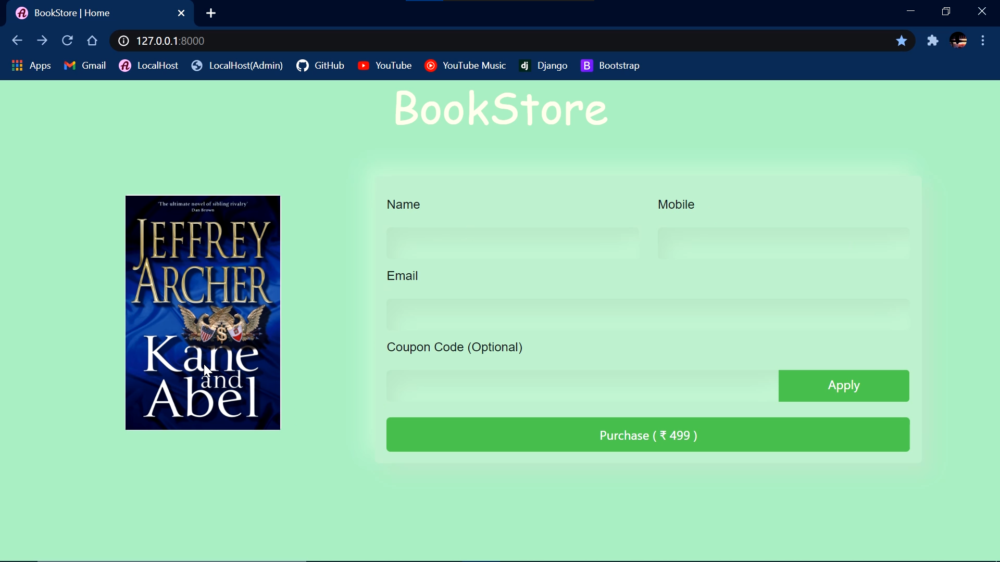

# BookStore
A bookstore app to demonstrate the Coupon system & Razorpay Integration with Django.

### Installation

1 - Setup the Project

```bash
git clone https://github.com/ashutosh-874/BookStore_Project.git
cd BookStore_Project
```

2 - Activate Virual Environment

```bash
python -m venv venv
.\venv\Scripts\activate
```

3 - Install requirements

```bash
pip install -r requirements.txt
```

4 - Enter your Credentials

In order to acheive the payment functionality, you must put your razorpay credentials at marked location in books/views.py and books/templates/books/checkout.html.

5 - Runserver on port 8000

```bash
python manage.py runserver
    
http://127.0.0.1:8000/
```

